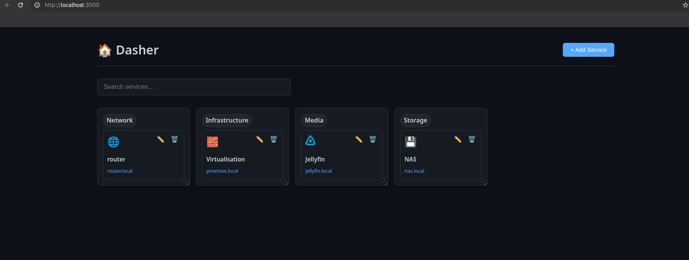
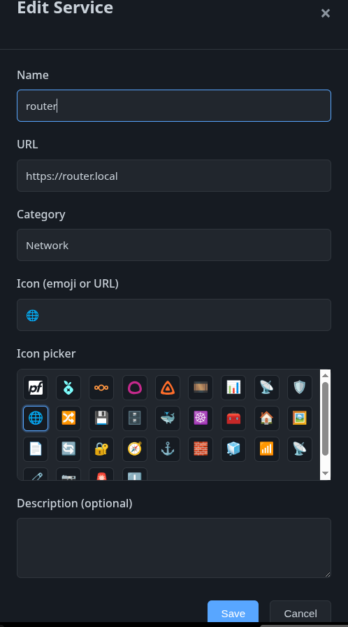

# Dasher 🏠

A simple, dark-themed home lab dashboard for managing links to your self-hosted services.  This was inspired by my need for a lightweight, customizable dashboard to quickly access my various home lab services. If you need a more feature-rich solution, consider [Heimdall](https://heimdall.site/) or [Dashy](https://demo.dashy.to/).

## Features

- 🎨 Dark mode UI inspired by GitHub's design
- 📱 Responsive grid layout
- ➕ Add/edit/delete services through the UI
- 🔍 Search and filter services
- 📂 Automatic grouping by categories
- 💾 Persistent storage via JSON file
- 🐳 Docker Compose deployment
- 🔐 Optional basic authentication

## Quick Start

### Using Docker Compose (Recommended)

Clone the repository and navigate to the project directory:

```bash
# Start the dashboard
docker compose up -d

# View logs
docker compose logs -f

# Stop the dashboard
docker compose down
```

Access the dashboard at `http://localhost:3000`

### Development Mode (optional)

```bash
# Install dependencies
npm install

# Start development server
npm run dev
```

Note: npm install is only needed for local development. Docker builds install dependencies inside the image.

## Configuration

Services are stored in `data/services.json`. The file is automatically created on first run with sample data.

### Service Schema

```json
{
  "id": "unique-id",
  "name": "Service Name",
  "url": "http://service.local",
  "category": "Category Name",
  "icon": "🎬",
  "description": "Optional description"
}
```

### Authentication

To enable basic authentication, you can either use environment variables in [docker-compose.yml](docker-compose.yml) or use a `.env` file (recommended for keeping secrets out of version control).

#### Using .env file (Recommended)

1. Copy `.env.example` to `.env`:
   ```bash
   cp .env.example .env
   ```

2. Edit `.env` and set your credentials. **Important:** Escape the `$` symbols in your bcrypt hash with backslashes:
   ```bash
   AUTH_ENABLED=true
   AUTH_USERNAME=yourusername
   AUTH_PASSWORD_HASH="\$2b\$10\$your-bcrypt-hash-here"
   SESSION_SECRET=your-random-secret-key
   ```

#### Using docker-compose.yml directly

Alternatively, set these environment variables directly in [docker-compose.yml](docker-compose.yml):

```yaml
environment:
  - AUTH_ENABLED=true
  - AUTH_USERNAME=yourusername
  - AUTH_PASSWORD_HASH=$2a$10$your-bcrypt-hash-here
  - SESSION_SECRET=your-random-secret-key
```

Generate a bcrypt hash for your password:

```bash
node -e "console.log(require('bcryptjs').hashSync('yourpassword', 10))"
```

If you don’t have Node installed locally, use Docker instead:

```bash
docker run --rm node:18-alpine sh -lc "npm -s i bcryptjs --prefix /tmp/bc >/dev/null 2>&1 && NODE_PATH=/tmp/bc/node_modules node -e 'console.log(require(\"bcryptjs\").hashSync(\"yourpassword\", 10))'"
```

Default credentials when `AUTH_ENABLED=true` without custom hash: `admin` / `admin`

## Usage

1. **Add a Service**: Click the "+ Add Service" button in the top right
   1. A modal will appear where you can enter service details and the category
2. **Edit a Service**: Click the ✏️ icon on any service card
3. **Delete a Service**: Click the 🗑️ icon on any service card
4. **Search**: Use the search bar to filter services by name, category, or description
5. **Quick Access**: Click any service card to open the service in a new tab

## Customization

### Icons

You can use:
- Emojis: `🎬`, `☁️`, `📊`
- Image URLs: `https://example.com/icon.png`
- Local images: Place in `public/assets/` and reference as `/assets/icon.png`

### Styling

Edit `public/style.css` to customize colors, spacing, or layout. CSS variables are defined at the top for easy theming.

## Port Configuration

To change the default port (3000), update:
- `docker-compose.yml`: Change the port mapping
- `server.js`: Set the `PORT` environment variable

## Data Persistence

Service data is stored in the `./data` directory, which is mounted as a volume in Docker. This ensures your services persist across container restarts.

## Security Considerations

### Rate Limiting

Dasher does not include application-level rate limiting to maintain compatibility with reverse proxies. **If you expose Dasher publicly, you must configure rate limiting on your reverse proxy** to protect against brute force attacks and abuse.

**Recommended reverse proxy options:**
- **HAProxy** - Use `stick-table` for rate limiting
- **Nginx** - Use `limit_req_zone` and `limit_req` directives
- **Traefik** - Use rate limiting middleware
- **Cloudflare** - Provides rate limiting at the edge

**Example nginx rate limiting:**
```nginx
http {
    limit_req_zone $binary_remote_addr zone=login:10m rate=5r/m;
    
    server {
        location /api/login {
            limit_req zone=login burst=2 nodelay;
            proxy_pass http://dasher:3000;
        }
    }
}
```

### Authentication

- Always use strong passwords and bcrypt hashing
- Set a random `SESSION_SECRET` in production
- Keep `.env` files out of version control
- Use HTTPS through your reverse proxy for production deployments

## ScreenShots


